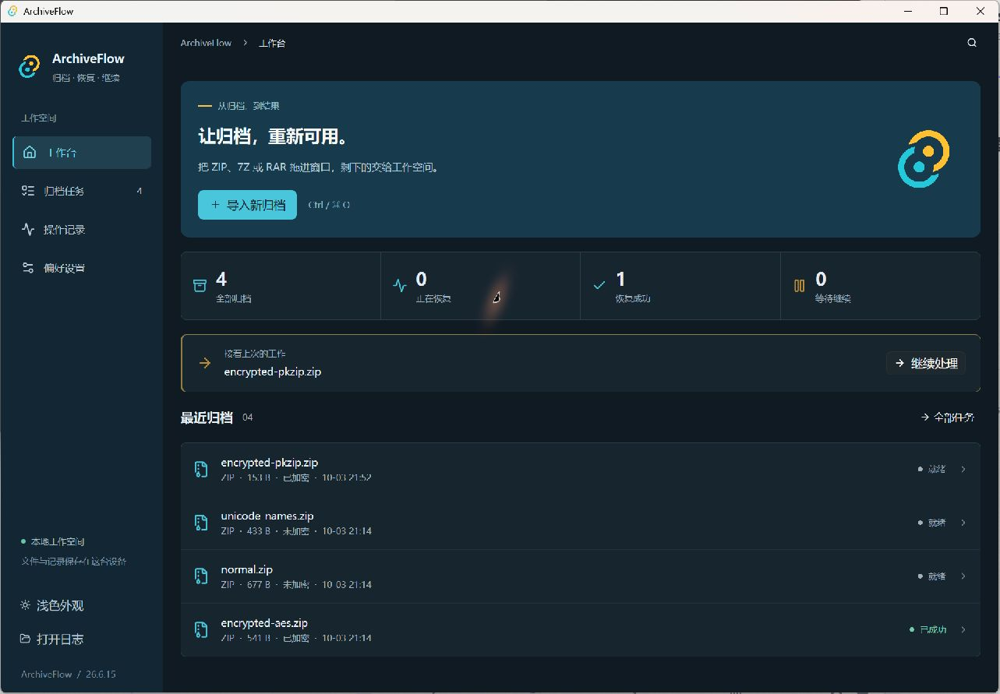

# ArchiveFlow

基于 **GPUI Kit 0.7 + Rust** 的原生桌面归档与密码恢复工具。界面由 GPU 直接渲染，不再使用 React、HTML、CSS、Tauri 或 WebView。

仅用于你有权访问、审计、恢复或测试的归档文件。所有任务、断点和结果保存在本机。



[查看浅色工作台](docs/native-ui/home-light.jpg) · [查看原生恢复详情页](docs/native-ui/detail-dark.jpg)。截图使用仓库测试归档和独立数据目录。

## 功能

- **工作台**：多文件导入、窗口拖放、可点击的任务统计、最近归档，以及随任务状态变化的继续处理入口。
- **任务管理**：紧凑列表、整行打开、搜索、状态筛选、分页、删除；CSV / JSON 导出当前筛选范围。
- **任务详情**：归档元数据、可折叠文件树、恢复状态和最近活动；成功后优先展示结果，运行时突出进度，规则与高级参数按需展开；窄窗口自动改为单列。
- **密码恢复**：字典、暴力和掩码模式；字典规则包含大小写、Leet、反转、重复、年份、后缀、组合与文件名种子，最多生成 50,000 个候选。
- **CPU / GPU**：复用原 Rust 多线程引擎与 hashcat 集成。CPU 支持暂停、取消与断点继续；GPU 支持 Windows ZIP 与取消，不支持暂停。
- **进度**：尝试数量、速度、已用时间、预计剩余时间、线程 / 设备数、最近断点。
- **操作记录**：分类筛选、搜索和分页，浏览最近 1,000 条；任务导出可附带完整审计记录。
- **设置**：外观与语言、恢复参数、结果与导出、本地数据四个分组；显示未保存状态，切换主题会保留当前编辑；关闭窗口时可保存、放弃修改或继续编辑，校验和写入失败不会静默退出。
- **原生交互**：系统文件选择及保存对话框、剪贴板、归档所在文件夹和日志目录入口；支持 Ctrl / ⌘ + O 导入、F 搜索、S 保存设置，以及可关闭的操作反馈。磁盘操作和检测在后台线程执行。

## 开发与运行

已在 Windows 的 Rust 1.99.0 MSVC 工具链上开发。需要 Rust、Cargo、对应平台的本地编译工具；不需要 Node.js 或 WebView2。

```sh
cargo run -p archiveflow-desktop
cargo build --release -p archiveflow-desktop
```

Windows 产物为 `target/release/archiveflow.exe`。GPUI Kit 使用系统的原生图形后端；平台依赖见 [GPUI Kit 安装说明](https://gpui-kit.com/docs/installation/)。

使用独立数据目录验证界面，不影响已有任务：

```sh
cargo run -- --data-dir ./target/ui-test-data --import ./fixtures/zip/encrypted-aes.zip
```

可重复使用 `--import` 导入多个文件。`--help` 显示参数说明。

## 数据兼容

沿用旧版应用标识 `com.archiveflow.app` 和 `archiveflow.db` 数据库结构：

- Windows：`%APPDATA%/com.archiveflow.app/`
- macOS：`~/Library/Application Support/com.archiveflow.app/`
- Linux：`$XDG_DATA_HOME/com.archiveflow.app/`，未设置时使用 `~/.local/share/`

任务、结果、操作记录和 CPU 断点直接继续使用。启动会将上次异常退出的运行中任务标记为中断；正常关闭时先停止后台恢复、保存草稿并等待断点写入。等待超过 8 秒会显示继续等待和强制退出选项；强制退出可能丢失尚未落盘的改动及最新恢复进度。切换版本前应退出旧应用，避免同时操作同一数据库。

进度快照由独立线程刷新，字典候选在后台生成；导入或检测耗时期间仍能查看进度。hashcat 的路径查找、版本检测、设备检测分别有 3 秒、5 秒、15 秒时限，超时会终止并回收该探测子进程。

原生偏好保存在同目录的 `native-settings.json`，采用临时文件后原子替换。**旧 WebView localStorage 中的主题、语言及恢复偏好不会自动迁移**，首次使用原生版时需重新设置；旧 WebView 数据不会被删除。不要把包含个人路径或字典草稿的设置文件提交到仓库。

日志位于数据目录下的 `logs/archiveflow.log`。侧栏提供日志目录入口。

## 结构

```text
crates/
  core/                  与界面框架无关的业务库
    src/commands/        归档、任务、恢复、审计、导出的 Rust 接口
    src/runtime.rs       共享状态、进度、实例锁与退出协调
    src/services/        ZIP / 7Z / RAR 与 CPU / hashcat 引擎
    src/db/              既有 SQLite 结构与迁移
    tests/               原生宿主集成回归
  desktop/               GPUI Kit 应用
    src/main.rs          窗口启动与退出
    src/ui/              工作台、任务、详情、记录、设置
    src/worker.rs        后台请求与 UI 消息
    src/model.rs         偏好、文件树、筛选与字典规则
    icons/               桌面图标
fixtures/                测试归档
scripts/package.ps1      Windows / macOS 便携分发包
```

`docs/legacy-ui/` 保留迁移前的界面截图供对照，不代表当前 GPUI 界面。`docs/plans/` 与 `docs/benchmarks/` 中的旧技术栈、路径和命令属于历史记录；当前构建方式以本 README 为准。

## 验证

```sh
cargo fmt --all -- --check
cargo check --workspace --locked
cargo test --workspace --locked
```

核心测试包括格式检测、CPU worker、调度器、断点、导出与真实测试归档的恢复。依赖本机 hashcat / GPU 的测试及性能基准保持 `ignored`，需要单独执行；通过常规测试不代表已验证真实 GPU。

## 分发

```powershell
cargo build --release -p archiveflow-desktop --locked
./scripts/package.ps1 -Platform windows
```

Windows 打包为便携 ZIP。macOS runner 使用 `-Platform macos` 生成包含 `.app` 的 ZIP。迁移后的分发不再依赖 Tauri 安装器；macOS 签名与公证需在发布环境另行配置。

原生 CI 会在 Windows / macOS 上执行格式、测试和编译检查。创建版本标签时发布流程生成草稿 Release，供检查后发布。
